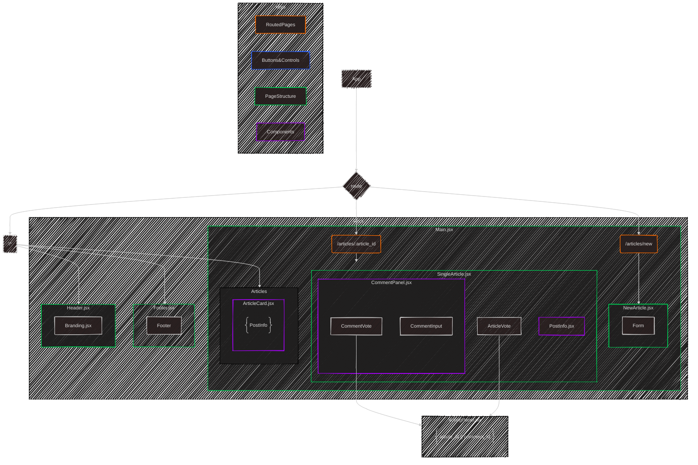

```mermaid
---
config:
  look: handDrawn
  theme: neo-dark
---

flowchart TD

    %% Chart Nodes

    subgraph keys
        RoutedPages
        Buttons&Controls
        PageStructure
        Components
    end
    1[Root]
    A[App]
    C{route}

    AllRoutes(\*)


    ArticlesRoute(/articles/:article_id)
    NewArticlesRoute(/articles/new)

    %% Links
    A --> C
    C --> AllRoutes
    C --> ArticlesRoute
    C --> NewArticlesRoute
    AllRoutes --> Header.jsx
    AllRoutes --> Articles
    AllRoutes --> Footer.jsx
    ArticlesRoute --> SingleArticle.jsx
    VBA --> VotingPanel.jsx
    VBC --> VotingPanel.jsx
    NewArticlesRoute --> NewArticle.jsx

    subgraph 1[Root]
        subgraph Header.jsx
            Branding.jsx
        end
        subgraph Main.jsx
            ArticlesRoute
            NewArticlesRoute
            subgraph Articles
                subgraph ArticleCard.jsx
                    Card@{ shape: braces, label: "PostInfo" }
                end
            end
            subgraph SingleArticle.jsx
                PostInfo.jsx
                VBA[ArticleVote]
                    subgraph CommentPanel.jsx
                        CommentInput
                        VBC[CommentVote]
                        end
            end
            subgraph NewArticle.jsx
                Form
            end
        end
        subgraph Footer.jsx
            Footer
        end
    end

    subgraph VotingPanel.jsx
        Panel@{shape: braces, label: "article_id || comment_id"}
    end


    %% Styling

    style RoutedPages stroke:#FF6D00
    style Buttons&Controls stroke:#2962FF
    style PageStructure stroke:#00C853
    style Components stroke:#AA00FF

    style ArticlesRoute stroke:#FF6D00
    style NewArticlesRoute stroke:#FF6D00

    style Main.jsx stroke:#00C853
    style Footer.jsx stroke:#00C853
    style Header.jsx stroke:#00C853
    style SingleArticle.jsx stroke:#00C853
    style NewArticle.jsx stroke:#00C853


    style ArticleCard.jsx stroke:#AA00FF
    style CommentPanel.jsx stroke:#AA00FF
    style PostInfo.jsx stroke:#AA00FF

```
